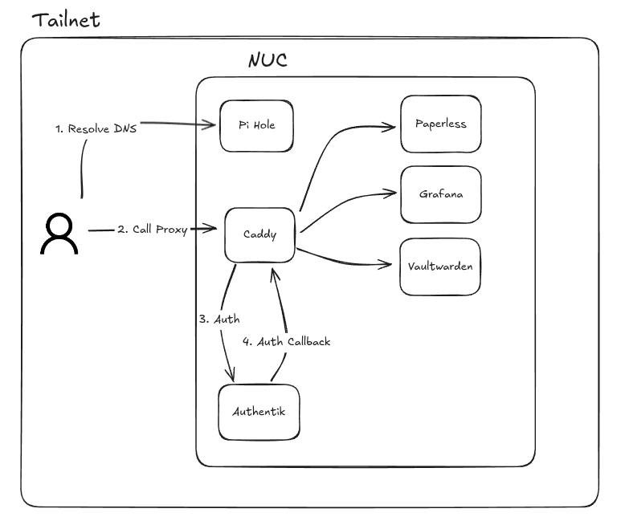

# Edubuque Homelab

## Overview

This repository contains the infrastructure and configuration for my personal homelab environment. The goal of this project is to provide a streamlined, reproducible setup for self-hosting various services in a secure and maintainable way. It serves both as documentation for my own setup and as a reference for others looking to establish their own home server infrastructure.

Homelabbing has been a transformative learning experience for me, offering hands-on practice with technologies like Docker, networking, system administration, and security. This project emphasizes security-first design through the use of Tailscale for networking, automated firewall configuration, and containerized services.

## Table of Contents

- [Overview](#overview)
- [Installation and Setup](#installation-and-setup)
  - [Prerequisites](#prerequisites)
  - [Setup](#setup)
- [Services](#services)
- [Architecture](#architecture)
- [Upcoming Features/WIP](#upcoming-featureswip)
- [Self-hosting Resources](#self-hosting-resources)

## Installation and Setup

### Prerequisites

- Machine running Ubuntu 22.04 (tested and confirmed working)
- A Tailscale account for setting up your Virtual Private Network
- Docker installed on the system
- `make` installed on the system

### Setup

1. Clone this repository to your server
   ```bash
   git clone https://github.com/edubuque/homelab.git
   cd homelab
   ```

2. Initialize the system (sets up Tailscale VPN and configures firewall)
   ```bash
   make init_system
   ```

3. Start individual services
   ```bash
   make up FOLDER=<service_folder>
   ```
   
   For example, to start the dashboard:
   ```bash
   make up FOLDER=dashboard
   ```

## Architecture

### Virtual Network

The homelab is connected to a virtual private network (VPN) through Tailscale. This provides a secure and private network for all devices to access the homelab services. Every device that accesses the homelab must be connected to the Tailscale VPN.

### Deployment Configuration

The homelab is deployed using Docker and Docker Compose. The services are configured to run in separate containers and are linked together using Docker Compose networks. The Caddy reverse proxy is used to forward requests to the appropriate service running in a Docker container. 

**Docker Network Configuration**

- `caddy_net`: A Docker network used by the Caddy reverse proxy to forward requests to the appropriate service running in a Docker container. All services that are exposed through Caddy are connected to this network.

*Note*: Some services such as Pi-hole Internal and Caddy are issues static IPs in the caddy_net to allow for DNS resolution by domain name by Docker services.(e.g. paperless wants to authenticate with authentik. Paperless sets it's DNS server as the Pi-hole internal IP which forwards the domain request of 'authentik.internal.com' to the Caddy reverse proxy's static IP. The Caddy reverse proxy then forwards the request to the appropriate service running in a Docker container.)

### High-level Architecture



1. The device connected to the Tailnet will make a query to "\<subdomain\>.\<domain\>.\<tld\>"(e.g. paperless.internal.com). The Pi-hole DNS server configured to be a SplitDNS through the Tailnet will resolve this query to the Tailnet IP address of the NUC(Next Unit of Computing), aka. the server running this homelab.
2. The Caddy reverse proxy running on the NUC will listen to the https and http ports 443 and 80 respectively. It will forward the request to the appropriate service running in a Docker container while issuing and renewing TLS certificates automatically.
3. This Authentik instance is an Identity Provider that provides single sign-on capabilities for all homelab services. Depending on the application setup this single sign-on may occur in the reverse proxy setup or at the application level.
4. Sign-in is completed via the Authentik instance and the user is authorized for access to the requested service depending on the group the user is a member of.
5. The Caddy reverse proxy will forward the request to the appropriate service.


## Upcoming Features/WIP

- [ ] Add Authentik Single Sign-On to all services
    - [X] Add Authentik Single Sign-On to Paperless
    - [X] Add Authentik Single Sign-On to Portainer
    - [X] Add Authentik Single Sign-On to Grafana
    - [ ] Add Authentik Single Sign-On to Vaultwarden
- [ ] Add Pangolin Tunnel hosted on VPS with Authentik Single Sign-On for controlled public access
- [ ] Try out different Open-Source Dashboards
- [ ] Setup and Deploy Nextcloud (concerns with compute power and storage)
- [ ] Setup and Deploy Network Storage with file sync for document sharing across devices
- [ ] LLM multi-service RAG
    - [X] Setup and Deploy Ollama on PC
- [ ] Setup and Deploy publicly accessible documentation ( BookStack? )


## Services

- **Authentik**: An open-source Identity Provider focused on flexibility and versatility, providing single sign-on capabilities for all homelab services.
  - [Service Directory](authentik/)
  - [Official Repository](https://github.com/goauthentik/authentik)

- **Caddy**: A powerful reverse proxy and web server that automatically manages HTTPS certificates. Routes internal service traffic through custom domain names with automatic TLS and subpath support, simplifying secure access via Tailscale and DNS.
  - [Service Directory](caddy/)
  - [Official Repository](https://github.com/caddyserver/caddy)

- **Camera WebSocket Proxy**: Custom proxy service for securely accessing and streaming IP cameras(supports integrations with streaming and video-playback).
  - [Service Directory](camera-ws-proxy/)

- **Dashboard**: A WIP custom web dashboard for monitoring and managing homelab services.
  - [Service Directory](dashboard/frontend/)

- **DuckDNS**: Dynamic DNS service client that keeps your domain pointing to your home IP address even when it changes.
  - [Service Directory](duckdns/)
  - [Official Website](https://www.duckdns.org/)

- **Excalidraw**: Virtual whiteboard for sketching hand-drawn like diagrams.
  - [Service Directory](excalidraw/)
  - [Official Repository](https://github.com/excalidraw/excalidraw)

- **FreshRSS**: A self-hosted RSS feed aggregator.
  - [Service Directory](fresh-rss/)
  - [Official Repository](https://github.com/FreshRSS/FreshRSS)

- **Grist**: A modern relational spreadsheet that combines the flexibility of a spreadsheet with the structure of a database.
  - [Service Directory](grist/)
  - [Official Repository](https://github.com/gristlabs/grist-core)

- **IT Tools**: Collection of handy tools for developers and IT professionals.
  - [Service Directory](it-tools/)
  - [Official Repository](https://github.com/CorentinTh/it-tools)

- **Minecraft Crossplay**: Server setup for both Java and Bedrock edition Minecraft with cross-platform play.
  - [Service Directory](minecraft-crossplay/)

- **MinIO**: High-performance, S3 compatible object storage system.
  - [Service Directory](minio/)
  - [Official Repository](https://github.com/minio/minio)

- **Monitoring**: System monitoring stack based on Grafana, Prometheus, and related tools.
  - [Service Directory](monitoring/)
  - [Grafana Repository](https://github.com/grafana/grafana)

- **n8n**: Workflow automation tool with a node-based approach.
  - [Service Directory](n8n/)
  - [Official Repository](https://github.com/n8n-io/n8n)

- **Paperless**: Document management system that transforms physical documents into searchable archives.
  - [Service Directory](paperless/)
  - [Official Repository](https://github.com/paperless-ngx/paperless-ngx)

- **Pi-hole (External)**: Local DNS server for SplitDNS integration of external clients.
  - [Service Directory](pihole-external/)
  - [Official Repository](https://github.com/pi-hole/pi-hole)

- **Pi-hole (Internal)**: Local DNS server for internal clients.
  - [Service Directory](pihole-internal/)
  - [Official Repository](https://github.com/pi-hole/pi-hole)

- **Portainer**: Container management platform that simplifies Docker deployments.
  - [Service Directory](portainer/)
  - [Official Repository](https://github.com/portainer/portainer)

- **ReactiveResume**: Free and open-source resume builder.
  - [Service Directory](reactiveresume/)
  - [Official Repository](https://github.com/AmruthPillai/Reactive-Resume)

- **Stirling PDF**: Powerful PDF manipulation toolset.
  - [Service Directory](stirling-pdf/)
  - [Official Repository](https://github.com/Stirling-Tools/Stirling-PDF)

- **Vaultwarden**: Lightweight Bitwarden server implementation.
  - [Service Directory](vaultwarden/)
  - [Official Repository](https://github.com/dani-garcia/vaultwarden)

## Self-hosting Resources & Links

- [r/selfhosted](https://www.reddit.com/r/selfhosted/) - Reddit community focused on self-hosting applications
- [r/Homelab](https://www.reddit.com/r/homelab/) - Reddit community for homelab discussions and showcases
- [selfh.st](https://selfh.st) - Collection of self-hosted application resources
- [awesome-selfhosted](https://github.com/awesome-selfhosted/awesome-selfhosted) - Curated list of self-hosted software
- [LinuxServer.io](https://www.linuxserver.io/) - Repository of Docker containers designed for home server use

